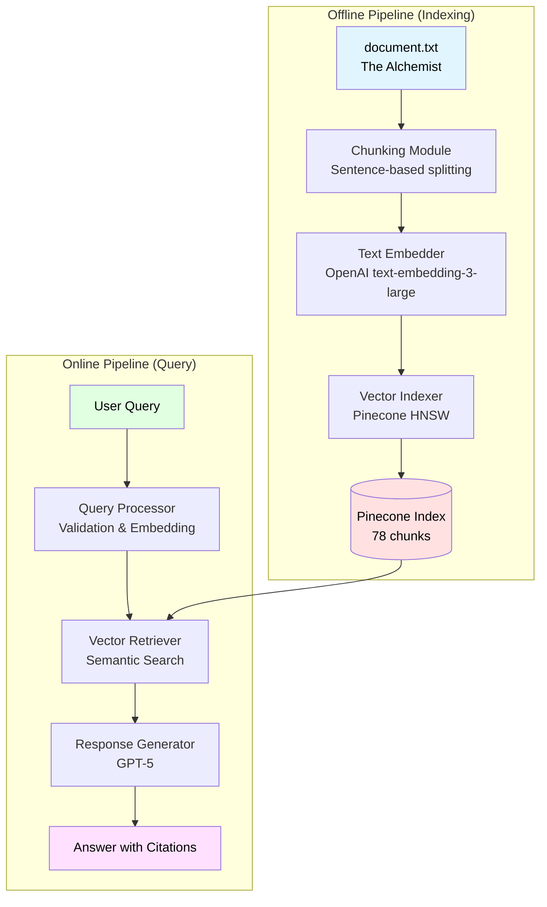
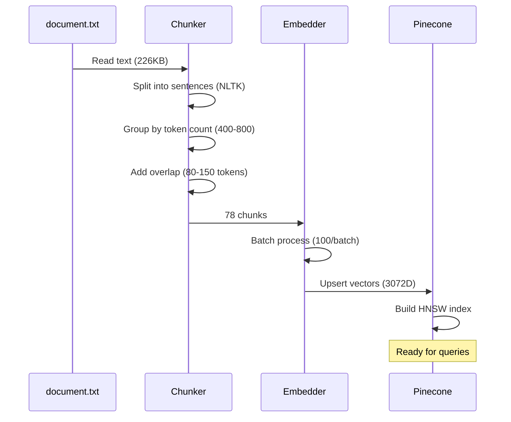
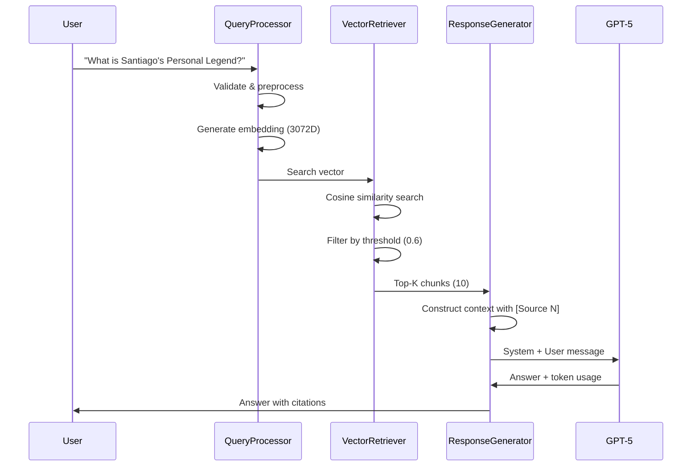

# RAG Pipeline Prototype

A production-ready Retrieval-Augmented Generation (RAG) system built with OpenAI embeddings, Pinecone vector database, and GPT-5. The system processes *The Alchemist* by Paulo Coelho to answer questions about the book with source citations.

## 📋 Overview

This project implements a complete RAG pipeline with separate **offline indexing** and **online query** stages. The system chunks documents intelligently, generates high-dimensional embeddings, stores them in Pinecone's HNSW index, and retrieves relevant context for GPT-powered question answering.

**Key Features:**
- 🔍 Semantic search with 3072-dimensional embeddings
- 📚 Intelligent sentence-based chunking (400-800 tokens)
- 🎯 Top-K retrieval with configurable similarity thresholds
- 🤖 GPT-5 powered answer generation with source citations
- 📊 Comprehensive logging and performance tracking
- ✅ 57 passing unit tests across all modules

## 🏗️ Architecture



## 📁 Project Structure

```
rag-prototype/
├── config.py                   # Configuration management
├── document.txt                # Source text (The Alchemist)
├── .env                        # API credentials (not in repo)
├── .env.example               # Environment template
├── pyproject.toml             # Poetry dependencies
│
├── offline/                    # Indexing pipeline
│   ├── chunking.py            # Sentence-based text chunking
│   ├── embedding.py           # OpenAI embedding generation
│   └── indexing.py            # Pinecone vector storage
│
├── online/                     # Query pipeline
│   ├── query.py               # Query processing & embedding
│   ├── retrieval.py           # Vector similarity search
│   └── generation.py          # GPT answer generation
│
├── scripts/                    # Executable scripts
│   ├── setup.py               # NLTK data download
│   ├── run_indexing.py        # Offline pipeline orchestrator
│   └── run_query.py           # Online pipeline orchestrator
│
├── tests/                      # Comprehensive test suite
│   ├── test_embedding.py      # 5 tests
│   ├── test_query.py          # 21 tests
│   ├── test_retrieval.py      # 17 tests
│   └── test_generation.py     # 19 tests
│
└── docs/                       # Documentation
    ├── SETUP-GUIDE.md         # Detailed setup instructions
    └── TEST_CASES.md          # 20 example queries
```

## 🛠️ Tech Stack

| Component | Technology | Purpose |
|-----------|-----------|---------|
| **Language** | Python 3.13 | Core implementation |
| **Dependency Management** | Poetry | Package management |
| **Embeddings** | OpenAI text-embedding-3-large | 3072-dimensional vectors |
| **Vector DB** | Pinecone (Serverless) | HNSW index for fast search |
| **LLM** | OpenAI GPT-5 | Answer generation |
| **Chunking** | NLTK + tiktoken | Sentence splitting + token counting |
| **Logging** | Loguru | Structured logging |
| **Testing** | pytest + unittest.mock | Unit & integration tests |
| **Retry Logic** | Tenacity | Exponential backoff for API calls |

## 🔄 Pipeline Flow

### Offline Pipeline (Indexing)



**Steps:**
1. **Load Document** - Read The Alchemist text (226KB)
2. **Chunking** - Sentence-based splitting with 400-800 tokens per chunk
3. **Embedding** - Generate 3072-dimensional vectors using OpenAI
4. **Indexing** - Upload to Pinecone with HNSW index
5. **Result** - 78 searchable chunks ready for retrieval

### Online Pipeline (Query)



**Steps:**
1. **Query Processing** - Validate and embed user question
2. **Retrieval** - Find top-K similar chunks (default: 10, threshold: 0.6)
3. **Context Construction** - Format retrieved chunks with source citations
4. **Generation** - GPT-5 generates answer from context
5. **Response** - Return answer with source references and token usage

## 🚀 Getting Started

### Prerequisites

- Python 3.13+
- Poetry
- OpenAI API key
- Pinecone API key

### Installation

1. **Clone the repository**
```bash
git clone <repository-url>
cd rag-prototype
```

2. **Install dependencies**
```bash
poetry install
```

3. **Download NLTK data**
```bash
poetry run python scripts/setup.py
```

4. **Configure environment**
```bash
cp .env.example .env
# Edit .env with your API keys:
# - OPENAI_API_KEY
# - PINECONE_API_KEY
# - PINECONE_ENVIRONMENT
```

### Running the Pipeline

#### Step 1: Index Documents (Offline)

Run once to index The Alchemist into Pinecone:

```bash
poetry run python scripts/run_indexing.py
```

**Expected output:**
```
✓ Loaded document (226.19 KB)
✓ Created 78 chunks
✓ Generated 78 embeddings (3072 dimensions)
✓ Uploaded 78 vectors to Pinecone
✓ Indexing complete (15.34s)
```

#### Step 2: Query the System (Online)

**Single query mode:**
```bash
poetry run python scripts/run_query.py "What is Santiago's Personal Legend?"
```

**Interactive mode** (multiple queries):
```bash
poetry run python scripts/run_query.py
# Then enter queries interactively
```

**With custom parameters:**
```bash
# Retrieve more chunks
poetry run python scripts/run_query.py -k 15 "Who is Fatima?"

# Lower similarity threshold
poetry run python scripts/run_query.py -s 0.5 "What is alchemy?"

# Verbose mode (show detailed progress)
poetry run python scripts/run_query.py -v "What are omens?"

# Combine parameters
poetry run python scripts/run_query.py -k 5 -s 0.7 -v "Who is the alchemist?"
```

## 📊 Example Output

```
================================================================================
ANSWER:
================================================================================
Santiago's Personal Legend is to search for and find the hidden treasure 
revealed in his dream near the Egyptian Pyramids. [Source 2][Source 1]

================================================================================
METADATA:
================================================================================
Model:            gpt-5
Sources:          2 chunks
Prompt tokens:    1682
Response tokens:  549
Total tokens:     2231
Total time:       16.91s

Source Chunk IDs:
  [1] 11 (similarity: 0.6581)
  [2] 10 (similarity: 0.6238)
================================================================================
```

## 🧪 Testing

Run the comprehensive test suite:

```bash
# All tests
poetry run pytest

# Specific module
poetry run pytest tests/test_generation.py

# With verbose output
poetry run pytest -v

# With coverage
poetry run pytest --cov=offline --cov=online --cov=config
```

**Test Coverage:**
- ✅ 5 tests - Embedding module
- ✅ 21 tests - Query processing
- ✅ 17 tests - Vector retrieval
- ✅ 19 tests - Answer generation
- **Total: 57 passing tests**

## 📚 Sample Queries

See [docs/TEST_CASES.md](docs/TEST_CASES.md) for 20 example queries organized by category:

- Character questions (Santiago, Fatima, Alchemist)
- Concepts & themes (Personal Legend, Soul of the World)
- Plot & journey (Dreams, treasure, crystal shop)
- Symbolic questions (Alchemy, omens, love)

Example:
```bash
poetry run python scripts/run_query.py "What does Maktub mean?"
poetry run python scripts/run_query.py "How does Santiago learn the Language of the World?"
poetry run python scripts/run_query.py "What is the significance of the treasure location?"
```

## ⚙️ Configuration

Key parameters in `.env`:

| Parameter | Default | Description |
|-----------|---------|-------------|
| `OPENAI_EMBEDDING_MODEL` | text-embedding-3-large | Embedding model |
| `OPENAI_CHAT_MODEL` | gpt-5 | Generation model |
| `OPENAI_EMBEDDING_DIMENSIONS` | 3072 | Vector dimensions |
| `CHUNK_MIN_TOKENS` | 400 | Minimum chunk size |
| `CHUNK_MAX_TOKENS` | 800 | Maximum chunk size |
| `CHUNK_OVERLAP_MIN` | 80 | Minimum overlap tokens |
| `CHUNK_OVERLAP_MAX` | 150 | Maximum overlap tokens |
| `TOP_K` | 10 | Number of chunks to retrieve |
| `RETRIEVAL_MIN_SCORE` | 0.6 | Similarity threshold |

## 📖 Documentation

- **[SETUP-GUIDE.md](docs/SETUP-GUIDE.md)** - Detailed implementation guide
- **[TEST_CASES.md](docs/TEST_CASES.md)** - Example queries with expected outputs

## 🔧 CLI Reference

### run_query.py Options

```bash
poetry run python scripts/run_query.py [OPTIONS] [QUERY]

Options:
  -k, --top-k INT          Number of chunks to retrieve (overrides config)
  -s, --min-score FLOAT    Minimum similarity score (overrides config)
  -t, --temperature FLOAT  Sampling temperature (default: 0.7, ignored for GPT-5)
  -m, --max-tokens INT     Maximum tokens to generate
  -v, --verbose            Show detailed progress

Examples:
  # Single query
  poetry run python scripts/run_query.py "What is Santiago's dream?"
  
  # Interactive mode
  poetry run python scripts/run_query.py
  
  # Custom parameters
  poetry run python scripts/run_query.py -k 5 -s 0.7 "Who is the alchemist?"
  
  # Verbose output
  poetry run python scripts/run_query.py -v "What are omens?"
```

## 🎯 Performance Notes

**Typical Query Performance:**
- Query processing: ~1.4s (embedding generation)
- Retrieval: ~0.5s (Pinecone search)
- Generation: ~12-15s (GPT-5 response)
- **Total: ~14-17s per query**

**Token Usage:**
- Embedding: ~50-100 tokens per query
- Prompt: 1,500-8,000 tokens (depends on retrieved chunks)
- Completion: 200-800 tokens (depends on answer complexity)
- **Average: ~2,000-5,000 total tokens per query**

**Cost Estimates (OpenAI pricing):**
- Embedding: $0.00013 per query
- GPT-5 generation: ~$0.01-0.05 per query (varies by token usage)

## 🛡️ Error Handling

The system includes comprehensive error handling:
- ✅ Retry logic with exponential backoff (3 attempts)
- ✅ Query validation (length, empty checks)
- ✅ Graceful degradation (continues with empty results)
- ✅ Detailed logging for debugging
- ✅ Token usage tracking for cost monitoring

## 🤝 Contributing

This is a prototype project for demonstrating RAG pipeline implementation. For production use, consider:

- Adding authentication and rate limiting
- Implementing caching for repeated queries
- Supporting multiple document sources
- Adding hybrid search (keyword + semantic)
- Implementing conversation memory for follow-up questions

## 📄 License

See [LICENSE](LICENSE) file for details.

## 🙏 Acknowledgments

- **Document Source**: *The Alchemist* by Paulo Coelho
- **Technologies**: OpenAI, Pinecone, NLTK, Poetry
- **Testing**: pytest, unittest.mock
